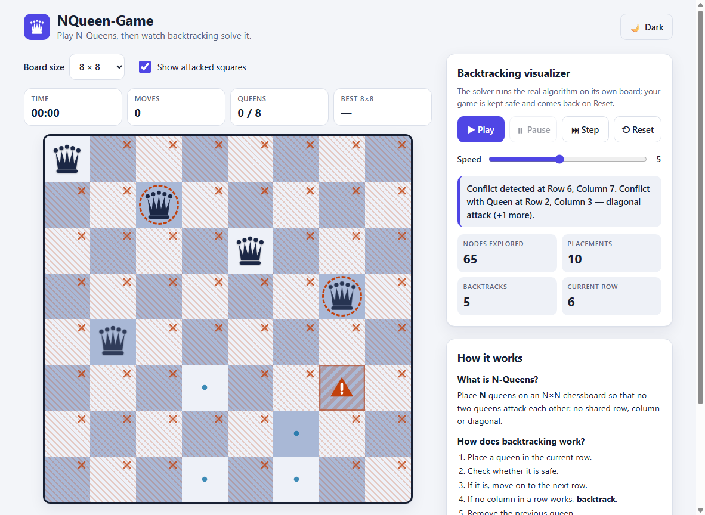

# NQueen-Game

**An interactive N-Queens game that visualizes the backtracking algorithm, one step at a time.**

[](https://shriyap1966.github.io/NQueen-Game/)
[](https://github.com/ShriyaP1966/NQueen-Game/actions/workflows/test.yml)


[](LICENSE)

## 🎮 Play the Game

**[Play NQueen-Game](https://shriyap1966.github.io/NQueen-Game/)**



## Features

- **Real backtracking visualizer.** Play, pause, step and change speed while the solver tries a square, checks it, places a queen, hits a conflict and backtracks. Live counters (nodes explored, placements, backtracks, current row) come straight from the running algorithm.
- **Any board from 4×4 to 12×12.**
- **Hints from the solver.** The suggested square always belongs to a real solution that includes your queens, or you are told the position is a dead end.
- **Clear conflicts.** Attacked squares use hatching and ✕ icons (not colour alone), and a bad move explains itself: *"Conflict with Queen at Row 2, Column 4 — diagonal attack."*
- **Undo / redo, timer, move counter** and **best times per board size** (saved in `localStorage`).
- **Light and dark theme**, responsive layout, keyboard navigation (arrow keys, Ctrl+Z / Ctrl+Y) and labelled board cells.

## How it works

Backtracking fills the board one row at a time. For each row it tries every column; if a square is safe it places a queen and moves to the next row, and if a row has no safe square it removes the previous queen and tries that queen's next column.

`js/solver.js` implements this as a recursive generator that yields an event for every step (`try`, `conflict`, `safe`, `place`, `backtrack`, `solution`). The UI pulls one event at a time, so the animation is the algorithm itself, with nothing precomputed. The same solver powers the hint button.

The "solver time" in the result panel measures only the algorithm's computation, not the animation delay.

## Tech stack

Plain HTML, CSS and JavaScript. There is no framework, no build step and no dependencies.

```
index.html   style.css
js/board.js    attack geometry and conflict explanations
js/solver.js   backtracking solver (event generator) + hints
js/game.js     player state: undo/redo, timer, best times
js/ui.js       rendering and controls
tests/run.js   unit tests (Node)
```

## Run locally

```bash
git clone https://github.com/ShriyaP1966/NQueen-Game.git
cd NQueen-Game
# open index.html in a browser, or serve it:
python -m http.server 8000
# run the tests (Node 18+):
node tests/run.js
```

## Future improvements

Algorithm comparison (bitmask, min-conflicts), a solution gallery, a daily puzzle and shareable puzzle links.

## License

[MIT](LICENSE)
